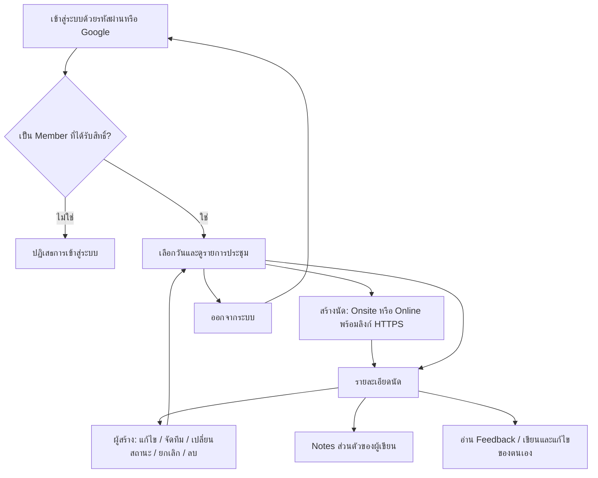
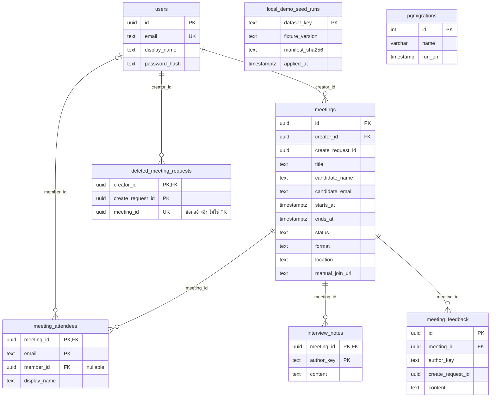

# eggdigital-assignment

| รายการ | ลิงก์ |
|---|---|
| Production Front End | [เปิดหน้า Login](https://frontend-production-1564.up.railway.app/login) |
| Production Back End | [API](https://backend-production-9356.up.railway.app/api/v1) · [Health](https://backend-production-9356.up.railway.app/api/v1/health/ready) |
| Wireframe | [เปิด Wireframe](https://apinyattp.github.io/eggdigital-assignment/doc/) |
| UI design | [เปิด UI design](https://apinyattp.github.io/eggdigital-assignment/doc/ui-design.html) |

## 1. Flow



## 2. DB diagram

โครงสร้างหลัง migration ถอด provider; แสดงคีย์และฟิลด์หลัก เส้นเชื่อมคือ foreign key จริงเท่านั้น



`author_key` เป็นข้อมูลผู้เขียน ไม่ใช่ FK ไป `users`; `deleted_meeting_requests` ยังใช้ป้องกันการสร้างนัดที่ลบแล้วซ้ำจาก request เดิม

## 3. วิธีติดตั้งแบบ step by step

เตรียม Git, Node.js `>=24.19.0 <25` พร้อม npm และ Docker Compose แล้วเปิด Docker

1. ดาวน์โหลดโครงการและเข้าโฟลเดอร์

   ```sh
   git clone https://github.com/apinyattp/eggdigital-assignment.git
   cd eggdigital-assignment
   ```

2. สร้างไฟล์ตั้งค่าและคีย์สำหรับเครื่องนี้ คำสั่งจะรักษาไฟล์เดิม

   ```sh
   [ -f .env ] || cp .env.example .env
   npm ci --prefix backend
   npm run setup:local --prefix backend
   npm run setup:bridge --prefix backend
   ```

   หากใช้ Google login ให้กรอก `GOOGLE_CLIENT_ID` และ `GOOGLE_CLIENT_SECRET` ใน `.env` และตั้ง OAuth redirect เป็น `http://localhost:3000/api/auth/callback/google`; เว้นว่างได้เมื่อใช้รหัสผ่าน

3. สร้างและเริ่มระบบ (Docker ติดตั้ง dependencies ของ Front End ให้ และ Back End รัน migrations ก่อนเริ่ม)

   ```sh
   docker compose --env-file .env --env-file backend/.local.env --env-file backend/.bridge.local.env up --build -d --wait
   ```

4. สร้างบัญชีตัวอย่างสำหรับเข้าใช้งาน

   ```sh
   docker compose --env-file .env --env-file backend/.local.env --env-file backend/.bridge.local.env exec backend npm run seed:login
   ```

5. เปิด [หน้า Login](http://localhost:3000/login) ใช้ `sample01@example.test` และรหัส `LOGIN_FIXTURE_PASSWORD` จากไฟล์ส่วนตัว `backend/.local.env` บัญชีตัวอย่างนี้ใช้รหัสผ่าน ไม่ใช่บัญชี Google

   Backend: `http://localhost:3001` · PostgreSQL: `127.0.0.1:5432` (database/user: `meeting_manager`, รหัส `POSTGRES_PASSWORD` ในไฟล์เดียวกัน)
