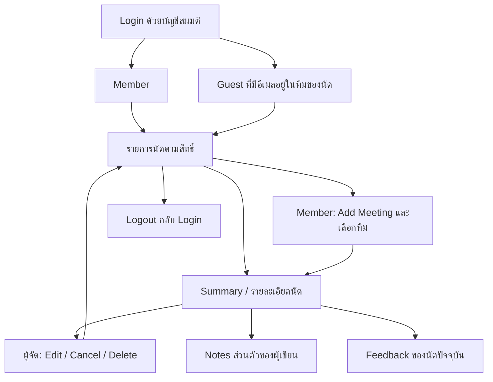

# eggdigital-assignment

## URL
| Method | Path
|---|---|
| Frontend | [https://frontend-production-1564.up.railway.app](https://frontend-production-1564.up.railway.app)
| Backend | [https://backend-production-9356.up.railway.app/](https://backend-production-9356.up.railway.app/api/v1)

## Application flow overview
1. **Login:** an existing Member signs in with a password or an eligible Google account. NextAuth handles the browser login; the backend verifies membership and issues the API JWT. Candidate identities are denied, including an email that also appears as a Member. Google login does not register new Members.
2. **Dashboard:** the Member selects a date and sees meetings they created or attend, grouped as upcoming/current, rejected/cancelled, and past. Upcoming/current meetings use numeric pages of 10. Dates are interpreted in `Asia/Bangkok`.
3. **Create:** enter meeting and candidate details, start/end times, and at least one other Member. Choose Onsite with location or Online with a manually supplied HTTPS join link. Saving creates the local meeting and attendee records; it does not create a Google/Zoom room, Calendar event or invitation email.
4. **Detail and management:** open a meeting to view its summary. Only its creator can edit meeting details/status, manage the team, cancel or delete it. Start/end times and meeting format are not editable through the edit API. Status values are `PENDING`, `CONFIRMED`, `REJECTED` and `CANCELLED`; cancellation uses its own action. A stale edit is rejected so the user can reload current data.
5. **Interview content:** the creator and authorized attendees can keep their own private Interview Notes and read meeting Feedback. Each author has at most one feedback entry per meeting and can edit only their own entry. Feedback uses numeric pages of 50. Access is checked again when saving; another user's private notes are not exposed.
6. **Logout or expiry:** logout clears the current browser's NextAuth/API authentication state. Expiry requires login again; logout does not revoke copied JWTs or other browser sessions.

The browser talks to Next.js for login and to Express for meeting data. Express validates identity, authorization and inputs before using parameterized PostgreSQL queries. In production, browser API traffic must stay on the frontend's public origin through the `/api/v1` proxy described below.

## Flow overview




## Local setup

Requires Docker with Compose and Node.js 24.19 or a compatible Node 24 release. Keep actual secrets only in local ignored files; never copy them into `.env.example` or logs.

1. Keep the existing root `.env`. On a fresh checkout, copy `.env.example` to `.env` and fill Google fields only when configuring Google login. Blank Google configuration does not block password login.
2. Install backend tooling and generate separate private local database/JWT/test-fixture credentials. Compose loads this local runtime file after root `.env`, so its local database/JWT/fixture values take precedence and blank example placeholders cannot mask them. Google fields still come from root `.env`. The separate ignored `backend/.bridge.local.env` supplies a shared server caller key and an independent NextAuth secret; `setup:bridge` preserves an existing file. This command preserves any existing `backend/.local.env` and never overwrites root `.env`:

   ```sh
   npm ci --prefix backend
   npm run setup:local --prefix backend
   npm run setup:bridge --prefix backend
   ```

3. Start the local services:

   ```sh
   docker compose --env-file .env --env-file backend/.local.env --env-file backend/.bridge.local.env up --build -d
   docker compose --env-file .env --env-file backend/.local.env --env-file backend/.bridge.local.env exec backend npm run seed:login
   ```

   Open `http://localhost:3000/login`. The backend listens at `http://localhost:3001`. PostgreSQL has no published port. Compose explicitly constructs its database URL for the owned `db` service; it does not migrate a database URL taken from an unknown remote environment. Migrations run before backend startup and retain history. Normal restarts retain the named database volume.

4. The synthetic local member is `sample01@example.test`. Its generated password is `LOGIN_FIXTURE_PASSWORD` in your private `backend/.local.env`; inspect it locally, not in shared logs/chat. `candidate01@example.test` deliberately overlaps Candidate and member roles and must be denied. These fixtures are not real Google accounts. Seed is idempotent and preserves existing rows; changing a fixture password setting does not silently replace an existing user's stored hash.

Useful operations:

```sh
docker compose --env-file .env --env-file backend/.local.env --env-file backend/.bridge.local.env ps
docker compose --env-file .env --env-file backend/.local.env --env-file backend/.bridge.local.env logs --tail=60 backend
docker compose --env-file .env --env-file backend/.local.env --env-file backend/.bridge.local.env stop
docker compose --env-file .env --env-file backend/.local.env --env-file backend/.bridge.local.env up -d
```

After intentionally changing local configuration, recreate the affected service with `up -d --force-recreate backend`. Do not use `docker compose config` without `--quiet` in shared output: expanded configuration contains secrets. Do not use `down -v` as a normal stop; it deletes local database data.

## API and frontend integration

All endpoints use JSON and `Cache-Control: no-store`. Browser requests use `credentials: 'include'`. POST requests require `Origin: http://localhost:3000`, `Content-Type: application/json`, and `X-Requested-With: MeetingManager`. Browser endpoints never return an app JWT in the response body. The authenticated internal issuer returns it only to the Next server.

| Method | Path | Purpose |
|---|---|---|
| GET | `/api/v1/auth/session` | Resolve current identity and fixed expiry without renewal |
| POST | `/api/v1/auth/logout` | Clear API/legacy transaction cookies; no database or JWT required |
| GET | `/api/v1/health/ready` | Database readiness |

The retired POST `/api/v1/auth/login`, `/api/v1/auth/google/start`, and `/api/v1/auth/google/exchange` return 404. Start browser login from the Next frontend `/login`; NextAuth and its completion bridge own browser login state. The previous frontend `/auth/google/callback` is retired. L4 session and L5 clear-only logout remain available for compatibility.

Google's active web application redirect is `http://localhost:3000/api/auth/callback/google`; origin is `http://localhost:3000`. The client secret is server-only. Configure the provider registration deliberately; do not automatically overwrite an existing provider setting. Legacy backend exchange files remain for compatibility but their login routes are disabled. No provider token is saved for Calendar, and no Google identity is automatically inserted as a member. Non-authoritative third-party email admission is not enabled. Actual Google login requires an authorized provider account/consent setup and is separate from controlled test fixtures.

The private server route `POST /internal/auth/issue` accepts `{method:"password",email,password}` or `{method:"google",idToken}` with `X-Auth-Service-Key` and JSON. It returns an Express-signed `accessToken`, expiry and current user to the authenticated Next server only; it sets no cookie. NextAuth completion delivers that same token as HttpOnly `mm_access`. Optional `X-Request-ID` is accepted only as a UUID; otherwise a server request ID is used. The route is outside browser CORS and requires its separate caller key. The Express signing key is never provided to Next. An unset caller key disables internal issuance safely.

There is no login-attempt rate limit or count-based lockout for password or Google. Authentication, Candidate denial, expiry, CSRF, one-use OAuth state and bounded transient state protection remain. The internal B1 slice and the FE NextAuth browser flow have separate validation evidence; the three legacy Express login entry routes are retired (404).

For local development, the frontend uses the public API URL `http://localhost:3001/api/v1`; no secrets belong in `NEXT_PUBLIC_*` settings. The authenticated application includes meeting lists, create/edit/detail flows, cancellation/deletion, interview notes and feedback, and numeric pagination.

Paginated endpoints receive `page` and `pageSize` and return `items`, `page`, `pageSize`, `total`, and `totalPages` (the meeting list places these under its current-meeting group). Page sizes are positive integers capped at 10 for meetings, 20 for member search, and 50 for feedback; the frontend keeps those existing default sizes. Empty results have `totalPages: 0`; an out-of-range page retains the requested page and returns no items. The latest-five rejected/cancelled and past meeting sections remain previews. Meeting and feedback continuation requests retain signed snapshots bound to the requested size and current identity. SQL applies the limit/offset; the frontend does not paginate a fetched full dataset. For rolling deployments, the frontend derives `totalPages` from validated `total` and the unchanged page size when an older backend omits it; a provided value must match. Older frontends ignore the additive field and continue sending the existing default sizes. Default-size snapshot payloads and binding rules are unchanged; existing key lifetime and invalidation behavior still apply. Smaller page sizes require the newer backend and are not sent by the frontend.

Browser logout coordinates cancellation and clearing of NextAuth state and API cookies. Express L5 alone clears only API/legacy transaction cookies and is not the complete NextAuth logout flow. Other browsers and copied JWTs are not revoked. JWTs expire at their original deadline (default 900 seconds); each protected request rechecks current database and Candidate status. The NextAuth bridge guards completion against cancellation and waits for in-flight work before final clearing; discarding JavaScript results alone does not undo `Set-Cookie`.

## Development and checks

The frontend and backend have separate package manifests and lockfiles. Each can be installed independently. The backend uses strict TypeScript and routes → controllers (`req`, `res`, `next`) → services → parameterized PostgreSQL models. It has no runtime session/revocation table or persistent Google account linking.

```sh
npm run typecheck --prefix backend
npm run build --prefix backend
npm test --prefix backend
npm run test:integration:isolated --prefix backend
npm run smoke:local --prefix backend
```

The isolated integration command creates a uniquely named PostgreSQL test container, applies migrations and synthetic fixtures, runs real SQL/HTTP checks, then removes only that container and verifies removal. It never uses root `.env` or a production database. Controlled Google fixtures verify application behavior but do not prove a real Google account login.

`smoke:local` checks the running backend readiness, three retired routes, unauthenticated session/internal-issuer denial, and clear-only logout/CSRF. It loads no credentials, performs no database writes and does not restart services. It does not replace authenticated issuer, real PostgreSQL, browser NextAuth, or genuine provider tests.

For standalone BE execution, inject `DATABASE_URL` pointing to your owned local database plus `JWT_SIGNING_KEY_BASE64`; the remaining defaults are `PORT=3001`, `ALLOWED_ORIGIN=http://localhost:3000`, fixed local JWT issuer/audience, TTL 900 and `COOKIE_SECURE=false`. Run `npm run migrate`, `npm run seed:login` (with private `LOGIN_FIXTURE_PASSWORD`), then `npm run dev` from `backend/`. Never expose database or signing values on the command line. HTTPS configurations require secure cookies. Compose is the verified local setup target; Railway preparation and outstanding deployment prerequisites are below.

## Applying database migrations

Migrations and seeds are separate operations. Migrations apply pending schema changes and record their names in `pgmigrations`; an ordinary rerun skips already recorded migrations. They do not reset the database. Keep the existing history and migration files intact, and back up a non-disposable database before applying schema changes.

### Local Docker Compose

Complete Local setup first. Compose injects `DATABASE_URL` for its own `db` service from the private `backend/.local.env`; do not paste a connection string or password into a command. The backend's normal Compose startup already runs `npm run migrate` before starting the server, so no additional migration step is needed for normal startup.

To deliberately apply newly added pending migrations while the backend container is running, execute from the repository root:

```sh
docker compose --env-file .env --env-file backend/.local.env --env-file backend/.bridge.local.env exec backend npm run migrate
```

If the backend is stopped, start the database and run a one-off migration container instead:

```sh
docker compose --env-file .env --env-file backend/.local.env --env-file backend/.bridge.local.env up -d db
docker compose --env-file .env --env-file backend/.local.env --env-file backend/.bridge.local.env run --rm backend npm run migrate
```

Inspect the recorded history and, after starting the backend, its HTTP readiness:

```sh
docker compose --env-file .env --env-file backend/.local.env --env-file backend/.bridge.local.env exec db psql -U meeting_manager -d meeting_manager -c 'SELECT name, run_on FROM pgmigrations ORDER BY id;'
curl --fail http://localhost:3001/api/v1/health/ready
```

The current migration set contains 11 files. Compare their names with the history; a healthy HTTP response alone does not prove that every expected migration is present. Local fixture creation is the separate `npm run seed:login` command from Local setup. Do not delete the volume or migration history to rerun a migration.


## Interactive wireframe

ดู [ภาพรวม flow และวิธีติดตั้ง/เปิดต้นแบบ](doc/README.md): Login → Member/Guest → รายการนัด → Add/Edit/ทีม/Cancel/Delete → Summary พร้อม Notes ส่วนตัวและ Feedback

ต้นแบบอยู่ใน `doc/` ใช้ข้อมูลสมมติและ local static server ไม่ต้องรัน backend ดู [Wireframe](https://apinyattp.github.io/eggdigital-assignment/doc) หรือ [UI design](https://apinyattp.github.io/eggdigital-assignment/doc/ui-design.html) โดยดาวน์โหลด/clone แล้วเปิดตามขั้นตอนในคู่มือ

ส่วนนี้เป็นต้นแบบที่เก็บไว้เพื่ออ้างอิงการออกแบบ เส้นทาง Member/Guest ในต้นแบบไม่ใช่สิทธิ์ของแอปปัจจุบัน ซึ่งอนุญาตให้เข้าสู่ระบบเฉพาะ Member ตาม Application flow overview ด้านบน
