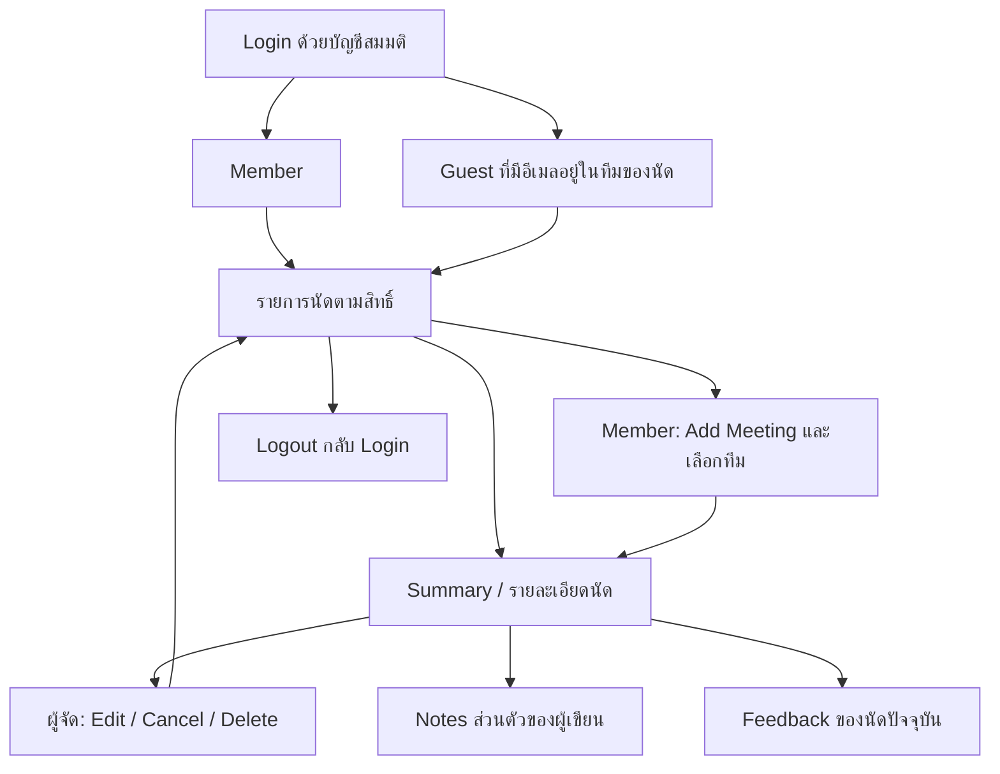

# Meeting Scheduler — interactive wireframe

เปิดต้นแบบได้จากไฟล์ HTML โดยไม่ต้องติดตั้งแอปหรือรัน backend:

- [Wireframe](index.html): หน้าจอแบบโครงร่าง
- [UI design](ui-design.html): หน้าจอพร้อมสีและองค์ประกอบ
- [คู่มือทดลอง](preview-guide.html): วิธีดูสถานะและข้อมูลตัวอย่าง

## Flow overview



- รายการแบ่ง Upcoming/Current, Cancelled/Rejected และ Past กลุ่มแรก10รายการต่อหน้า อีกสองกลุ่มแสดงล่าสุดกลุ่มละ5รายการ โดยกรองตามสิทธิ์และวันที่เริ่มนัด
- Member เลือกทีมด้วยตัวเลือกสมาชิกในแบบฟอร์ม Add; Guest ไม่มีสิทธิ์สร้างหรือแก้นัด ผู้จัดแก้รายละเอียด/ทีม/สถานะได้ตามหน้าต้นแบบ แต่วันและเวลาใน Edit ถูกล็อก Cancel คงรายการไว้ ส่วน Delete มี dialog ยืนยันแยกต่างหาก
- Add รองรับข้ามวัน วันเริ่มตั้งแต่วันนี้และวันเวลาจบต้องอยู่ในอนาคต รวมทั้งหลังวันเวลาเริ่ม
- Summary แยก Description, Preparation Notes, Notes ส่วนตัว และ Feedback ต้นแบบจำลองการแสดง Notes ตามผู้เขียน และ Feedback เฉพาะนัดปัจจุบัน แสดงเวลาล่าสุดของแต่ละ Feedback; การอ่านย้อนหลังไม่รวม Feedback จากนัดอื่น
- การแสดงหรือแก้ข้อมูลเหล่านี้เป็นการจำลองใน browser ไม่ใช่การบังคับสิทธิ์ด้วย server

## การติดตั้งและเปิดดู

สิ่งที่ต้องมี: browser รุ่นปัจจุบัน และ Python3 สำหรับวิธีเปิดผ่าน local server ไม่ต้องใช้ npm, Docker หรือ backend สำหรับต้นแบบนี้

1. ดาวน์โหลด ZIP หรือ clone repository แล้วเปิด terminal ในโฟลเดอร์รากที่มี `doc/`
2. ตรวจ Python ด้วย `python3 --version` (ถ้าเครื่องใช้ชื่อ `python` ให้ใช้ `python --version` และคำสั่ง `python` แทน)
3. เพื่อใช้การบันทึกจำลองใน browser อย่างสม่ำเสมอ ให้เปิด terminal ที่ราก repository แล้วรัน:

```sh
python3 -m http.server 8080 --bind 127.0.0.1 --directory doc
```

จากนั้นเปิด [UI design บนเครื่องตนเอง](http://127.0.0.1:8080/ui-design.html) หรือ [Wireframe](http://127.0.0.1:8080/index.html) และหยุด server ด้วย Ctrl+C เมื่อดูเสร็จ หาก port8080 ถูกใช้ ให้เปลี่ยนเป็น8081ทั้งในคำสั่งและ URL GitHub แสดง source ของ HTML; ให้ดาวน์โหลดหรือ clone repository เพื่อเปิดต้นแบบ

## ลองสถานะและผลที่ควรเห็น

- หน้า Login แสดงบัญชีเดโมที่กรอกไว้ กด Login แล้วเห็นรายการของ Member; ใช้ Mock Google identity เลือก Guest ที่มีนัดหรือ Guest ที่ไม่มีนัดได้ โดยไม่มีหน้าลงชื่อเข้าใช้ Google จริง
- ใช้ Staff demo profile เปลี่ยนบัญชีสมมติ และ List state ทดลอง normal/loading/empty/error
- [Lifecycle demo](ui-design.html?lifecycleDemo=1#dashboard) เพิ่มข้อมูลสมมติสำหรับเห็นการแบ่งหน้า10รายการและข้อจำกัดล่าสุด5รายการ เปลี่ยน Preview clock เพื่อดูการจัดกลุ่มวันเวลา
- [Feedback100รายการ](ui-design.html?feedbackDemo=100#detail) ใช้ชุดข้อมูลแยกสำหรับลองอ่านย้อนหลัง; Next mock request จำลอง save/read failure และการลองใหม่
- บันทึกสำเร็จจะเปลี่ยนข้อมูลในต้นแบบ บันทึกล้มเหลวแสดงสถานะให้ลองใหม่ โดยไม่มีข้อมูลถูกส่งไป server

## ขอบเขตของต้นแบบ

ทุกชื่อ อีเมล รหัสผ่านตัวอย่าง นัด และลิงก์ห้องเป็นข้อมูลสมมติ ใช้เฉพาะข้อมูลสมมติในการทดลอง ไม่ได้เชื่อม OAuth/API/ฐานข้อมูล/Calendar/วิดีโอหรือส่งคำเชิญจริง การบันทึก Notes/Feedback ใช้ browser storage บน origin นี้; ล้าง site data เพื่อเริ่มใหม่ การรีโหลดไม่ได้รับประกันว่าจะล้างข้อมูลที่บันทึกจำลองไว้

ไฟล์ `revision-flow.js` เป็น source ของพฤติกรรมร่วม ซึ่งฝังไว้ใน HTML ทั้งสองไฟล์เพื่อเปิดต้นแบบได้สะดวก ไม่ต้องโหลดไฟล์นี้ซ้ำ โครงหน้าจอและข้อมูลจำลองใช้เวลา Asia/Bangkok (UTC+7); แถบ Preview clock ใช้ทดลองการจัดกลุ่มรายการ ส่วน validation วันเวลาที่เพิ่มนัดใช้เวลาปัจจุบันจริง

ดูแหล่งที่มาและใบอนุญาตของไฟล์ประกอบใน [ASSETS.md](ASSETS.md)
